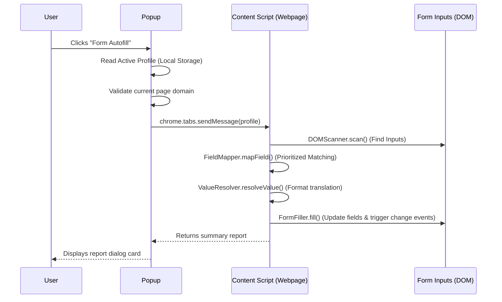

# VisaKit Autofill Engine

This document explains the architecture, field-matching logic, and event execution cycles of the VisaKit Autofill Engine.

---

## 🏗️ Architecture

The Autofill Engine runs strictly in the browser context inside a Manifest V3 content script sandbox. This separates user-sensitive data from the webpage until form filling is authorized by the user via the Extension Popup.

---

## 🔍 Matching Strategy

To reliably locate target fields on the Indian Visa Portal, the engine uses a prioritized search checklist. If a field maps to a `VisaProfile` field, it is filled. Otherwise, it is skipped.

Priority matching order:
1.  **Name attribute**: Matches exact keys or matches partial strings (e.g. `given_name` -> `givenName`).
2.  **ID attribute**: Scans the input element's `id` tag.
3.  **Autocomplete attribute**: Matches form standard autocomplete properties.
4.  **Associated Label Text**: Resolves text inside `<label>` elements linked to the input's `id`, or parent labels wrapper.
5.  **Placeholder attribute**: Checks input placeholder texts (e.g. "Enter Surname").

---

## ⚙️ Event Dispatching & React Support

Modern frameworks (like React, Angular, or Vue) bind input values to internal component state. Modifying `element.value` alone does not notify these framework controllers, causing values to disappear when clicking submit.

To solve this, our `FormFiller` dispatches standard synthetic events immediately after writing value states:
-   **Text Inputs / Textareas**: Triggers `input`, `change`, and `blur` events.
-   **Select Dropdowns / Radio buttons**: Triggers `change` and `click` events.

---

## 📅 Date Conversion

The Indian Visa Portal uses free-form text boxes for date attributes that expect format strings (like `DD/MM/YYYY`) instead of standard HTML5 date inputs.

Our `ValueResolver` inspects input placeholders. If a date field contains a placeholder representing a custom day/month split, it translates standard `YYYY-MM-DD` profiles into `DD/MM/YYYY` or `DD-MM-YYYY` formats dynamically.

---

## 🔒 Security & Privacy

1.  **Zero Network Traversal**: The engine runs entirely locally. It does not contain any remote scripts, does not communicate with external APIs, and does not upload profile fields.
2.  **No CAPTCHA Interaction**: To comply with portal guidelines, we do not bypass, read, or automate CAPTCHA security modules. The user must manually solve captchas and click submit.
3.  **No logs**: No sensitive passport particulars are ever saved to local developer consoles or telemetry trackers.
